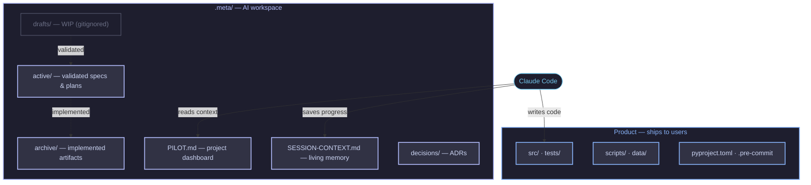

<p align="center">
  
</p>

<p align="center">
  <a href="LICENSE"></a>
  <a href="https://www.python.org"></a>
  <a href="https://github.com/astral-sh/uv"></a>
  <a href="https://copier.readthedocs.io"></a>
  <a href="https://claude.ai/code"></a>
</p>

# metadev-protocol

> One command, your AI-ready Python project: automatisms, conventions, skills, agents, secrets scanning, and session context. Premium vibe-coding out of the box.

```bash
copier copy gh:Vincent-20-100/metadev-protocol my-project --trust
cd my-project && claude
```

---

## The Problem

Every AI-assisted project starts the same way, and hits the same walls:

- **You already lost that context.** Each session starts from scratch. You re-explain the architecture, the decisions, the current state. Every. Single. Time.
- **Your codebase is a mess.** Drafts, scratch files, brainstorm notes pile up next to production code. The AI can't tell what ships and what doesn't.
- **Your best prompts stay behind.** You build great workflows and guidelines for one project — then start from zero on the next one.
- **Your rules stopped working.** You wrote instructions in CLAUDE.md. The AI followed them for a while, then drifted. No enforcement, no hooks, just hope.
- **You spend more time supervising than building.** The AI creates files anywhere, skips tests, forgets to update docs. You're prompting the same things over and over instead of coding.

---

## The Solution

metadev-protocol generates a **fully wired Python project** where the AI follows the workflow without being told — because the rules are encoded in the structure, not in your prompts.

The core principle: **separate what ships from how you build it.**



Drafts are gitignored. Validated artifacts (`active/`) and history (`archive/`) are committed. Context is preserved — every session picks up where the last one ended.

---

## What You Get

- **10 automatisms** — context loading at session start, mandatory plan before any edit, architecture sync, session handoff at the end. Hard-wired in `CLAUDE.md`, they fire without prompting.
- **9 rules** — the non-negotiable contract between you and the AI. Few hard rules that are always followed beat many soft rules that are sometimes ignored.
- **8 skills** — `/brainstorm`, `/spec`, `/debate`, `/plan`, `/orchestrate`, `/test`, `/lint`, `/save-progress`. Reusable across every project you generate.
- **5 agent personas** — code-reviewer, test-engineer, security-auditor, data-analyst, devil's-advocate. Defined in `AGENTS.md`, invoked on demand.
- **Hooks over instructions** — every Python file is auto-linted on save (ruff PostToolUse hook), dangerous operations are blocked or require confirmation, co-authored-by trailers suppressed natively.
- **Session continuity** — `PILOT.md` (project dashboard) + `SESSION-CONTEXT.md` (living context rewritten each session). Claude remembers what you decided three weeks ago.
- **`.meta/` taxonomy** — `active/` · `archive/` · `drafts/` · `decisions/` · `references/`. Filename convention enforced by pre-commit hook.
- **Secret scanning** — 40+ regex patterns, local audit script, pre-commit hook, 2 GitHub Actions (push gate + publicization alert). [Details](docs/public-safety.md)
- **Two execution modes** — `safe` (default, asks before touching repo structure) or `full-auto` (unsupervised runs, safety-net deny only). [Details](docs/execution-modes.md)
- **Versioned updates** — `copier update` propagates template improvements to existing projects. Review the diff, resolve conflicts, done.

---

## Generated Structure

```
my-project/
├── CLAUDE.md                       # Session contract (10 automatisms + 9 rules)
├── AGENTS.md                       # Agent personas (5 specialists)
├── pyproject.toml                  # uv, ruff, pytest
├── .pre-commit-config.yaml         # Lint + hooks + secret scan
│
├── src/my_project/                 # Package source
├── tests/                          # Test suite
├── scripts/
│   ├── check_meta_naming.py        # .meta/ filename convention
│   ├── check_git_author.py         # Block AI authorship
│   └── audit_public_safety.py      # Secret + sensitive file scanner
├── data/                           # raw/ → interim/ → processed/
│
├── .github/workflows/
│   ├── public-safety.yml           # Audit on push/PR to main
│   └── public-alert.yml            # Alert on repo publicization
│
├── .claude/
│   ├── settings.json               # Permissions, hooks, security
│   └── skills/                     # 8 built-in skills
│
└── .meta/
    ├── PILOT.md                    # Project dashboard (AI reads first)
    ├── SESSION-CONTEXT.md          # Living context (rewritten each session)
    ├── GUIDELINES.md               # Best practices (advisory)
    ├── active/                     # Validated plans/specs in flight
    ├── archive/                    # Implemented artifacts
    ├── drafts/                     # WIP (gitignored)
    ├── decisions/                  # Architecture Decision Records
    └── references/                 # raw/ → interim/ → synthesis/
```

---

## How It Works

### Law and Mentor

| File | Authority | Role |
|------|-----------|------|
| `CLAUDE.md` | **Law** | 10 automatisms + 9 rules. Non-negotiable. |
| `GUIDELINES.md` | **Mentor** | Best practices, anti-patterns, ADR templates. Proposed, not imposed. |

### Session lifecycle

Each session follows the same enforced sequence: read context → propose plan → get approval → implement (auto-lint on every edit) → test → conventional commit → rewrite context for the next session. If scope is unclear, the AI reaches for `/brainstorm → /spec → /debate` before writing any code.

This isn't a suggestion — it's what the 10 automatisms enforce. The AI does this because the structure tells it to, not because you asked.

---

## Quick Start

```bash
# 1. Install prerequisites
curl -LsSf https://astral.sh/uv/install.sh | sh        # macOS/Linux
# powershell -c "irm https://astral.sh/uv/install.ps1 | iex"  # Windows
uv tool install copier

# 2. Generate your project
copier copy gh:Vincent-20-100/metadev-protocol my-project --trust

# 3. Start building
cd my-project && claude
```

> [!NOTE]
> Requires [uv](https://github.com/astral-sh/uv), [copier](https://copier.readthedocs.io), and a [Claude Code](https://claude.ai/code) subscription.

### Update an existing project

```bash
copier update --trust
```

Template improvements are propagated via semver tags. Review the diff, resolve conflicts, done.

---

## Stack

| Tool | Role |
|------|------|
| [Python 3.13+](https://www.python.org) | Language |
| [uv](https://github.com/astral-sh/uv) | Package manager + venv |
| [ruff](https://github.com/astral-sh/ruff) | Lint + format |
| [copier](https://copier.readthedocs.io) | Template generation + updates |
| [pre-commit](https://pre-commit.com/) | Git hooks |
| [Claude Code](https://claude.ai/code) | AI assistant |

---

## Contributing

This repo applies the method to build the method.

```bash
git clone https://github.com/Vincent-20-100/metadev-protocol.git
cd metadev-protocol && uv sync
```

See [CONTRIBUTING.md](CONTRIBUTING.md) for the full workflow, [CREDITS.md](CREDITS.md) for inspirations, [CHANGELOG.md](CHANGELOG.md) for version history.

## License

[MIT](LICENSE)
