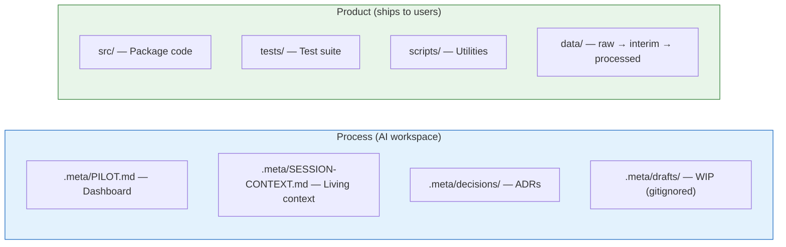
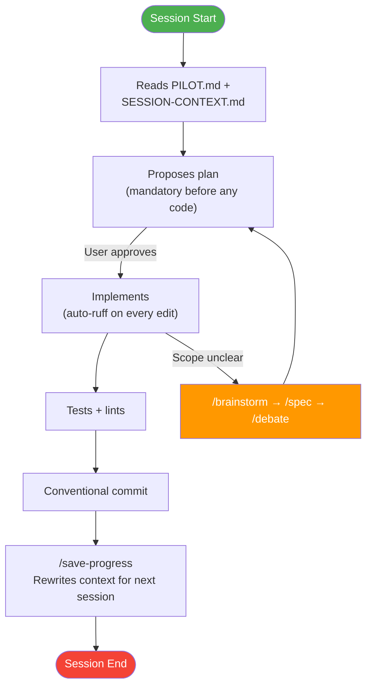

# metadev-protocol

[](LICENSE)
[](https://www.python.org)
[](https://github.com/astral-sh/uv)
[](https://github.com/copier-org/copier)
[](https://claude.ai/code)

> A high-performance Vibe Coding protocol based on the strict separation between **Project Deliverables** and **Development Context**.

---

## The Problem

Every AI-assisted project starts the same way — and hits the same walls:

- **Zero memory.** Each session starts from scratch. You re-explain the architecture, the decisions, the current state. Every. Single. Time.
- **Context soup.** Drafts, scratch files, brainstorm notes pile up next to production code. The LLM can't tell what ships and what doesn't.
- **Skills don't transfer.** You build great prompts, workflows, and guidelines for one project — then start from zero on the next one.
- **Instructions decay.** You write rules in CLAUDE.md. The LLM follows them for a while, then drifts. No enforcement, no hooks, just hope.
- **No structure, no discipline.** The LLM creates files anywhere, skips tests, forgets to update docs. You spend more time supervising than building.

The result: you're prompting the same things over and over instead of coding.

## The Solution

One command. Ready to build.

```bash
copier copy gh:Vincent-20-100/metadev-protocol my-project --trust
cd my-project && claude
```

metadev-protocol generates a **fully wired Python project** where the LLM follows the workflow without being told — because the rules are encoded in the structure, not in your prompts.



**Product and process never mix.** `src/` and `tests/` are the deliverable. `.meta/` is the AI workspace. Drafts are gitignored, validated artifacts (`active/`) and history (`archive/`) are committed. Context is preserved. Every session picks up where the last one ended.

---

## How It Works

### Session Lifecycle



This isn't a suggestion — it's **10 automatisms hard-wired in CLAUDE.md** that fire without prompting: context loading at session start, mandatory plan before any edit, architecture sync on changes, context rewrite at session end.

### Law and Mentor

| File | Authority | What it does |
|------|-----------|--------------|
| **CLAUDE.md** | Law | 10 automatisms + 8 rules. Non-negotiable. |
| **GUIDELINES.md** | Mentor | Best practices. Proposed, not imposed. |

Few hard rules that are always followed beat many soft rules that are sometimes ignored.

### Hooks Over Instructions

Critical behaviors are **automatic hooks**, not instructions the AI can ignore:

- Every Python file is auto-formatted and linted on save (ruff PostToolUse hook)
- First session is detected automatically (SessionStart hook)
- Dangerous operations are blocked or require confirmation (security deny/ask rules)
- Co-authored-by trailers suppressed natively (`attribution.commit: ""`)

---

## What You Get

| Category | Details |
|----------|---------|
| **10 automatisms** | Context loading, plan-before-code, architecture sync, session handoff |
| **8 skills** | /brainstorm, /spec, /debate, /plan, /orchestrate, /test, /lint, /save-progress |
| **5 agent personas** | code-reviewer, test-engineer, security-auditor, data-analyst, devil's-advocate (AGENTS.md) |
| **Data pipeline** | `data/raw/` → `data/interim/` → `data/processed/` — ready from day one |
| **Security** | Credential reads blocked, destructive commands denied, force-push asks confirmation |
| **Context continuity** | PILOT.md + SESSION-CONTEXT.md — zero context loss between sessions |
| **`.meta/` taxonomy** | `active/` · `archive/` · `drafts/` · `decisions/` · `references/` — filename convention enforced by pre-commit |
| **Visibility modes** | `meta_visibility=public` (default, commits `.meta/` except drafts) or `private` (gitignores entire `.meta/`) |
| **Execution modes** | `execution_mode=safe` (default, asks before touching repo structure) or `full-auto` (unsupervised runs, safety-net deny only) |
| **Public safety audit** | Stdlib script + pre-commit hook + 2 GitHub workflows, propagated to every generated project |
| **Versioned updates** | `copier update` propagates template improvements to existing projects |

---

## Quick Start

```bash
# 1. Install uv (if needed)
curl -LsSf https://astral.sh/uv/install.sh | sh        # macOS/Linux
# powershell -c "irm https://astral.sh/uv/install.ps1 | iex"  # Windows

# 2. Install copier
uv tool install copier

# 3. Generate your project
copier copy gh:Vincent-20-100/metadev-protocol my-project --trust

# 4. Start coding with AI
cd my-project && claude
```

Dependencies, hooks, and git init happen automatically.

### Update an existing project

```bash
copier update --trust
```

Template improvements are propagated via semver tags. Review the diff, resolve conflicts, done.

---

## Generated Structure

```
my-project/
├── CLAUDE.md                       # Session contract (10 automatisms + 8 rules)
├── AGENTS.md                       # Agent personas (5 specialists)
├── pyproject.toml                  # uv build, ruff, pytest
├── .pre-commit-config.yaml         # ruff + hooks + secret scan
│
├── src/my_project/                 # Package source
├── tests/                          # Test suite (mirrors src/)
├── scripts/
│   ├── check_meta_naming.py        # .meta/ filename convention
│   ├── check_git_author.py         # Block AI authorship
│   └── audit_public_safety.py      # Secret + sensitive file scanner
├── data/                           # raw/ → interim/ → processed/
├── docs/                           # Documentation
│
├── .github/workflows/
│   ├── public-safety.yml           # Audit on push/PR to main
│   └── public-alert.yml            # Alert on repo publicization
│
├── .claude/
│   ├── settings.json               # Permissions, hooks, attribution, security
│   ├── rules/                      # testing.md, code-style.md
│   └── skills/                     # 8 built-in skills
│
└── .meta/
    ├── PILOT.md                    # Project dashboard (read first)
    ├── SESSION-CONTEXT.md          # Living context (rewritten each session)
    ├── GUIDELINES.md               # Best practices (advisory)
    ├── active/                     # Validated plans/specs in flight
    ├── archive/                    # Implemented / historical artifacts
    ├── drafts/                     # WIP (gitignored)
    ├── decisions/                  # Architecture Decision Records
    └── references/                 # raw/ → interim/ → synthesis/
```

---

## Execution modes

At `copier copy` time you pick one of two Claude Code permission presets
via the `execution_mode` parameter:

| Mode | Use case | `permissions.allow` | `permissions.ask` |
|------|----------|---------------------|-------------------|
| **`safe`** (default) | Interactive dev, public forks, new users | `src/`, `tests/`, `.meta/`, `docs/` writes; `uv`, `git` (read/commit), `pytest`, `ruff`, `pre-commit`, `copier` | Touches to `pyproject.toml`, `CLAUDE.md`, `README.md`, `.claude/`, `.github/`, `git push`, `rm`, `mv`, `mkdir` |
| **`full-auto`** | Unsupervised runs (VPS, overnight spec execution) | Everything | Empty |

The `permissions.deny` safety net is **identical** in both modes and
covers the non-negotiable catastrophes: `rm -rf`, `sudo`, `dd`, `mkfs`,
`chmod -R 777`, `curl|sh`, `wget|sh`, `.env*`, `.git/**`, `~/.ssh`,
`~/.aws`, `~/.gnupg`, `~/.pypirc`, `~/.netrc`.

> ⚠️ **Full-auto warning.** Use `full-auto` only on environments where
> you accept that the AI can modify any file in the project without
> prompting. Never use it on a machine that holds production credentials
> outside the deny list, and never on a shared workstation.

**Switching modes after generation.** Two options:

1. Edit `.claude/settings.json` directly — it is plain JSON, nothing
   stops you from moving entries between `allow`, `ask`, and `deny`.
2. Re-run `copier update` with a different answer — copier will surface
   the diff; accept or reject it as you would any other template update.

Pair this with the `CLAUDE.md` rule *"Plan validated = all actions
validated"* (automatism #4) and a validated plan runs end-to-end
without mid-execution friction.

---

## Before going public

Four contact points defend against accidental secret leaks when transitioning a repo from private to public:

1. **Local manual run** — full audit on demand:
   ```bash
   uv run python scripts/audit_public_safety.py --mode=full
   ```
2. **Pre-commit hook** — quick secret scan on every commit (staged files only, automatic)
3. **GitHub Action on push/PR to `main`** — full audit gates merges via branch protection
4. **GitHub Action on `public` event** — reactive audit opens a critical issue if violations are detected

All four are propagated to every generated project.

### Enable branch protection on `main`

```bash
gh api -X PUT repos/OWNER/REPO/branches/main/protection \
  -f required_status_checks[strict]=true \
  -f required_status_checks[contexts][]=audit \
  -f enforce_admins=false \
  -f required_pull_request_reviews=null \
  -f restrictions=null
```

### Enable GitHub Secret Scanning

Go to **Settings > Code security and analysis** and enable:
- **Secret scanning** (detects known token formats from 200+ providers)
- **Push protection** (blocks pushes containing detected secrets)

These complement the local audit script, which catches custom patterns and structural issues.

---

## Stack

| Tool | Role |
|------|------|
| [Python 3.13+](https://www.python.org) | Language |
| [uv](https://github.com/astral-sh/uv) | Package manager + venv |
| [ruff](https://github.com/astral-sh/ruff) | Lint + format |
| [copier](https://github.com/copier-org/copier) | Template generation + updates |
| [pre-commit](https://pre-commit.com/) | Git hooks |
| [Claude Code](https://claude.ai/code) | AI assistant |

---

## Contributing

This repo applies the method to build the method.

```bash
git clone https://github.com/Vincent-20-100/metadev-protocol.git
cd metadev-protocol && uv sync
```

Read [CONTRIBUTING.md](CONTRIBUTING.md) for the full workflow. See [CREDITS.md](CREDITS.md) for inspirations and attributions, [CHANGELOG.md](CHANGELOG.md) for version history.

Current state and roadmap: `.meta/PILOT.md`. Past decisions: `.meta/decisions/`.

---

## License

[MIT](LICENSE)
